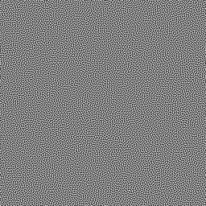
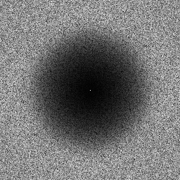

# Blue-Noise Dither Mask Tiles Generator

### Details
This repository provides a generator for dither masks with blue-noise power spectrums. 
The generated masks are tileable and can have arbitrary resolutions. 
The generator runs on the GPU and recquires an OpenGL4.5 compatible card.
Below is an example of a 256x256 dither mask generated with the repo:

 

A set of precomputed masks can be downloaded from the examples/ repository.

### Cloning

Clone the repository and all its submodules using the following command:
```sh
git clone --recursive git@github.com:jdupuy/BlueNoiseDitherMaskTiles.git
```

If you accidentally omitted the `--recursive` flag when cloning the repository you can retrieve the submodules like so:
```sh
git submodule update --init --recursive
```

### License
The code from this repository is released in public domain.
